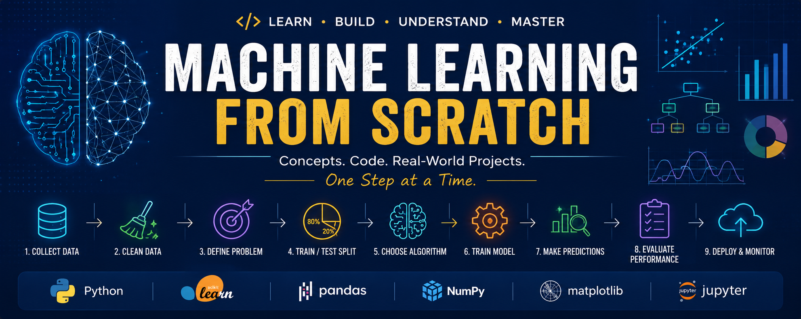

# 🚀 Machine Learning From Scratch

<p align="center">
  
</p>

> Learn Machine Learning from scratch with Python through hands-on projects, real-world datasets, and step-by-step explanations.

This repository accompanies my **Machine Learning From Scratch** LinkedIn series, where I explain ML concepts in a simple and practical way. Every topic includes:

- 📖 Concept explanation
- 🐍 Python implementation
- 📊 Visualizations
- 📈 Model evaluation
- 💡 Real-world use cases

Whether you're a student, software engineer, DevOps engineer, or someone transitioning into AI, this repository will help you build a solid foundation in Machine Learning.

---

# 📚 Learning Roadmap

| Part | Topic | Status |
|------|-------|--------|
| 01 | Machine Learning Lifecycle | ⏳ |
| 02 | House Price Prediction | ⏳ |
| 03 | Linear Regression | ⏳ |
| 04 | Logistic Regression | ⏳ |
| 05 | Decision Trees | ⏳ |
| 06 | Random Forest | ⏳ |
| 07 | K-Nearest Neighbors (KNN) | ⏳ |
| 08 | Support Vector Machines (SVM) | ⏳ |
| 09 | K-Means Clustering | ⏳ |
| 10 | Model Evaluation Metrics | ⏳ |
| 11 | Feature Engineering | ⏳ |
| 12 | Hyperparameter Tuning | ⏳ |
| 13 | Cross Validation | ⏳ |
| 14 | Ensemble Learning | ⏳ |
| 15 | Neural Networks | ⏳ |
| 16 | Deep Learning Basics | ⏳ |
| 17 | Convolutional Neural Networks | ⏳ |
| 18 | Recurrent Neural Networks | ⏳ |
| 19 | Transformers | ⏳ |
| 20 | MLOps Fundamentals | ⏳ |

---

# 📁 Repository Structure

```
machine-learning-from-scratch/
│
├── 01_ml_lifecycle/
│   ├── notebook.ipynb
│   ├── main.py
│   ├── README.md
│   └── images/
│
├── 02_house_price_prediction/
│
├── 03_linear_regression/
│
├── 04_logistic_regression/
│
├── 05_decision_tree/
│
├── 06_random_forest/
│
├── 07_knn/
│
├── 08_svm/
│
├── 09_kmeans/
│
├── 10_model_evaluation/
│
├── datasets/
│
├── assets/
│   ├── images/
│   └── diagrams/
│
├── requirements.txt
│
└── README.md
```

---

# 🛠 Tech Stack

- Python
- NumPy
- Pandas
- Matplotlib
- Scikit-learn
- Jupyter Notebook

As the series progresses, we'll also cover:

- TensorFlow
- PyTorch
- XGBoost
- LightGBM
- MLflow
- Docker
- FastAPI
- GitHub Actions

---

# 🚀 Getting Started

Clone the repository

```bash
git clone https://github.com/build-with-shivam/machine-learning-from-scratch.git
```

Navigate to the project

```bash
cd machine-learning-from-scratch
```

Install dependencies

```bash
pip install -r requirements.txt
```

Run any project

```bash
cd 02_house_price_prediction

python main.py
```

Or open the notebook

```bash
jupyter notebook
```

---

# 📂 What's Included in Every Project?

Each project follows the same structure to make learning consistent.

✅ Problem Statement

✅ Dataset Overview

✅ Data Preprocessing

✅ Feature Engineering (where applicable)

✅ Model Training

✅ Prediction

✅ Evaluation Metrics

✅ Visualization

✅ Key Takeaways

---

# 🎯 Who Is This Repository For?

- Students learning Machine Learning
- Software Engineers transitioning to AI
- DevOps Engineers exploring MLOps
- Data Science beginners
- Interview preparation
- Anyone who prefers learning through practical examples

---

# 📈 Learning Philosophy

This repository focuses on understanding **why** something works before learning **how** to implement it.

Every project starts with the concept, followed by a step-by-step Python implementation using real-world datasets.

The goal isn't just to achieve a high accuracy score—it's to understand the reasoning behind every decision in the Machine Learning workflow.

---

# 📅 LinkedIn Series

This repository is the official codebase for my **Machine Learning From Scratch** LinkedIn series.

Each post includes:

- 📖 Concept explanation
- 📊 Visual infographic
- 💻 Python implementation
- 🔗 Link to the corresponding code in this repository

Follow along as we build one Machine Learning project at a time.

---

# 🤝 Contributions

Contributions, suggestions, and improvements are always welcome.

If you find this repository useful:

⭐ Star the repository

🍴 Fork it

🐞 Open an issue

🚀 Submit a pull request

---

# 📬 Connect With Me

If you enjoy this series, feel free to connect with me on LinkedIn and follow along for future Machine Learning, AI, DevOps, Cloud, Kubernetes, and MLOps content.

---

## ⭐ If this repository helped you learn something new, consider giving it a star!